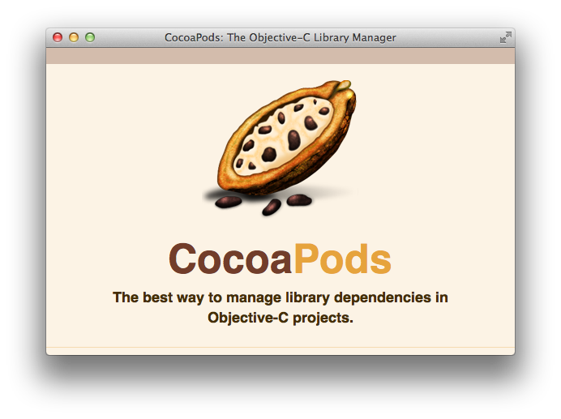
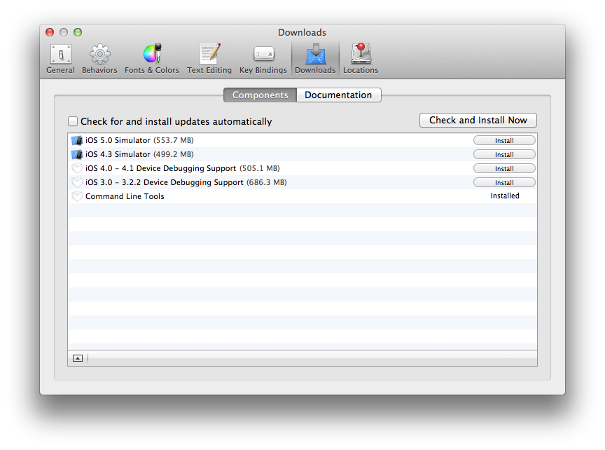

入門CocoaPods

2012/06/16

# 自己紹介
iOSとかRailsとかいじってます

twitter: @eielh

website: eiel.info
# アジェンダ
- CocoaPodsについて
  - インストール
  - 基本的な使い方
- CocoaPodsを試してみる
- オレオレライブラリを対応させてみる
# CocoaPodsについて
[CocoaPods](http://cocoapods.org/)

Objective-Cのライブラリ管理ツール
RubyのBundlerみたいなものです

Xcodeで外部ライブラリの利用は**設定がめんどくさい**
CocoaPodsを利用すると楽ができます。

基本的には使いたいライブラリをかいて

    $ pod install

利用可能ライブラリは日々増えてます。
実際にやるのはまた後で。
## インストール
CocoaPodsの紹介記事などをみるとCocoaRuby必要と書かれていることがありますが、
現在はLionにインストール済みのRubyでも利用できます。

必須条件
- rubygems 1.3.6以上
  OS X 10.7以上
- Command Line Tools for Xcodeのインストール

Command Line Tools For Xcode

preferencesより

### CocoaPodsのインストール

    $ gem install cocoapods
    $ pod setup

## 使い方
Xcodeのプロジェクトファイルのある場所でPodfileを作成

    platform :ios
    dependency 'JSONKit'
    dependency 'Reachability'

    $ pod install プロジェクト名.xcodeproj

2度目以降は

    $ pod install

でOK

pod installを行うと

- Podfile.lock
- Pods
- プロジェクト名.xcworkspace

が作成されます
### Podfile.lock

使用しているライブラリのバージョンが記録されます

### Pods

指定したライブラリや指定したライブラリの依存しているライブラリなどが配置されます。
### プロジェクト名.xcworkspace

今後はプロジェクトを開く際はこれを使用します

開発版では

    $ pod install

のみで済みます

# CocoaPodsを使ってみる

## Podfileの文法

Rubyの言語内DSL

[利用可能な命令](http://rubydoc.info/gems/cocoapods/Pod/Podfile)

http://rubydoc.info/gems/cocoapods/Pod/Podfile

# 試してみる

## DCIntrospect
Podfile

    platform :ios
    dependency "DCIntrospect"

https://github.com/domesticcatsoftware/DCIntrospect

## Color-Picker-for-iOS

    platform :ios
    dependency "DCIntrospect"
    dependency "Color-Picker-for-iOS"

https://github.com/hayashi311/Color-Picker-for-iOS

## どんなライブラリがあるの?

$ pod list

[リポジトリ](https://github.com/CocoaPods/Specs)

$ pod search キーワード

# 自分のライブラリをCocoaPodsで使う

podspecを作成すれば、リポジトリを直接指定して、
一覧にないライブラリも利用できます。

## podspecを作成する

    $ pod spec create 名前

`名前.podspec` が生成されます

`名前.podspec` を必要に応じてかきかえます。

### 文法チェック

$ pod spec lint 名前.podspec

### 使ってみる
Podfile

    platform :ios
    dependency "DCIntrospect"
    dependency "Color-Picker-for-iOS"
    dependency "ALPageView", :git => 'https://github.com/eiel/ALPageViewDemo/'

# 気になる点
ライセンスはライブラリごとに違うのでチェックを。

## なにかおかしくなったら
*.xcworkspaceとPodsを削除して pod install しなおしましょう

## スペックリポジトリの追加

    $ pod repo add NAME URL

# 参考文献など

- [CocoaPods](http://cocoapods.org/)
- [CocoaPods github](https://github.com/CocoaPods/CocoaPods)
- [個人的なメモ](http://ios.eiel.info/CocoaPods)
